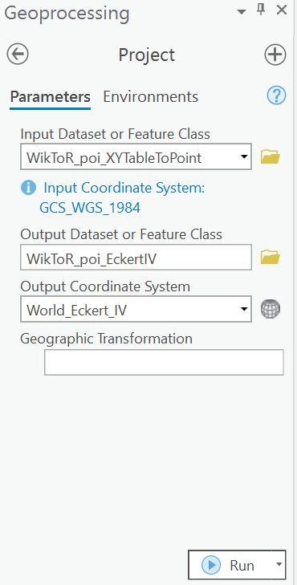
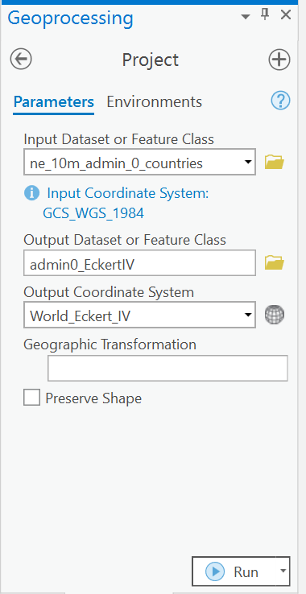
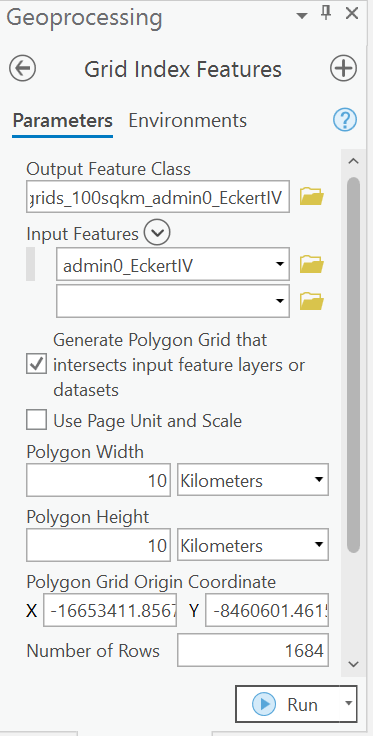
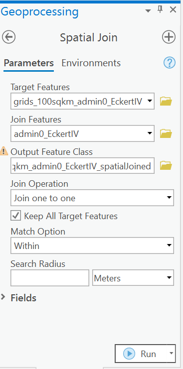
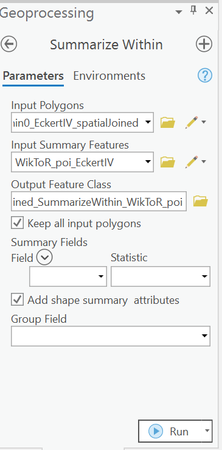
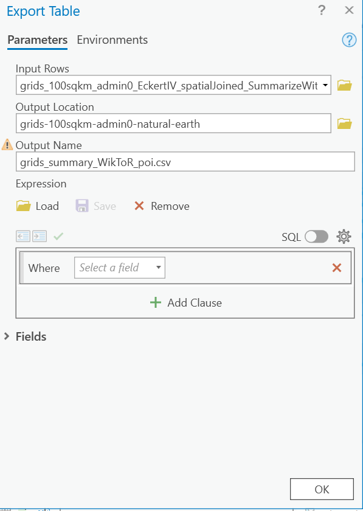
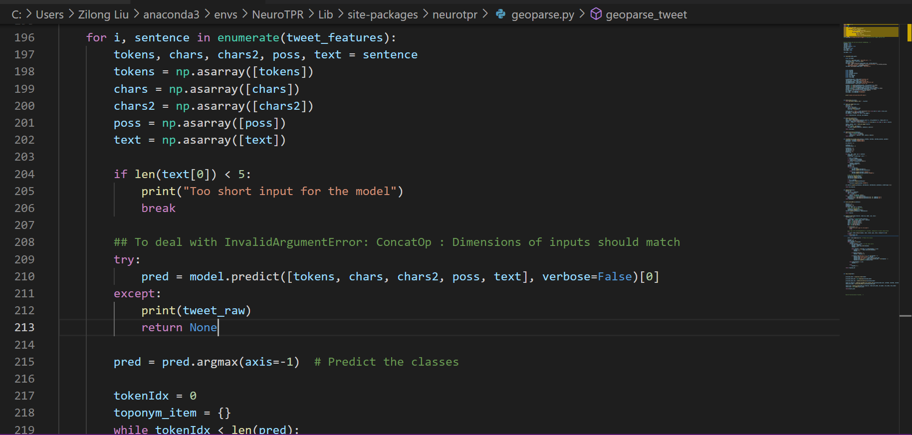
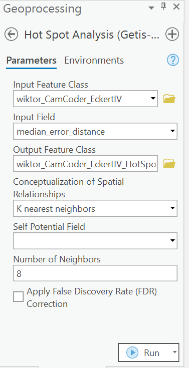

# Geoparsing: Solved or Biased? An Evaluation of Geographic Biases in Geoparsing
In this repository, we provide descriptions about how to reproduce our evaluation study. More information can found in our paper "Geoparsing: Solved or Biased? An Evaluation of Geographic Biases in Geoparsing" accepted by [AGILE 2022](https://agile-online.org/index.php/conference-2022). 

## Downloading Datasets
To reproduce our data preprocessing steps, you need to download several datasets first and put them in corresponding directories. Alternatively, you can also directly use our shared preprocessed datasets and jump to the **Deploying Geoparsers** section.

The country/region shapefile can be accessed as [Admin-0 Countries](https://www.naturalearthdata.com/http//www.naturalearthdata.com/download/10m/cultural/ne_10m_admin_0_countries.zip) from [Natural Earth](https://www.naturalearthdata.com), and should be put in `data/admin0-natural-earth/`. LGL, GeoVirus, and WikToR can be accessed [here](https://github.com/milangritta/Geocoding-with-Map-Vector/tree/master/data), and should be put in `data/evaluation-corpora/original-datasets/`. Their data patches can be accessed [here](https://github.com/google-research-datasets/mlg_evaldata), and should be put in `data/evaluation-corpora/data-patches/`. GeoCorpora can be accessed [here](https://github.com/geovista/GeoCorpora), and should be put in `data/evaluation-corpora/original-datasets/`. GeoWiki can be accessed [here](https://www.repository.cam.ac.uk/bitstream/handle/1810/277772/geowiki.txt.zip?sequence=5&isAllowed=y), and should be put in
`data/training-corpora/`. The [GeoNames](http://www.geonames.org/) gazetteer used by [CamCoder](https://github.com/milangritta/Geocoding-with-Map-Vector) can be accessed [here](https://www.repository.cam.ac.uk/bitstream/handle/1810/277772/allCountries.txt.zip?sequence=4&isAllowed=y), and should be put in `data/gazetteers/`.

## Data Preprocessing
### Annotated Location Extraction
To achieve both our spatially-explicit geoparsing performance evaluation and geographic bias evaluation, we extracted all annotated locations from training and evaluation corpora as well as the GeoNames gazetteer. The script used is [`scripts/annotated-poi-extraction.ipynb`](scripts/annotated-poi-extraction.ipynb). These extracted locations should be stored in `data/extracted-annotated-locations/`. 

### Splitting Articles in LGL, GeoVirus, and WikToR
To more easily run [Edinburgh Geoparser](https://www.ltg.ed.ac.uk/software/geoparser/), we split articles in LGL, GeoVirus, and WikToR into separate datasets. The scripts used is [`scripts/toponym-resolution-evaluation-corpora-splitting.ipynb`](scripts/toponym-resolution-evaluation-corpora-splitting.ipynb). The split datasets should be found at `data/evaluation-corpora/split-datasets/`.

### Grid Summary Generation
For the representation bias analysis, we generated grids containing a summary about the number of annotated locations located within for different datasets, respectively. This grid summary generation process was done in ArcGIS Pro 2.9.0. An example of using extracted annotated locations from WikToR is attached below. The grid summary dataset can be downloaded from our publicly-accessible [figshare repository](https://doi.org/10.6084/m9.figshare.17157785.v1).

(1) First, use [XY Table To Point](https://pro.arcgis.com/en/pro-app/latest/tool-reference/data-management/xy-table-to-point.htm) to convert WikToR's annotated locations into point features.

(2) Then, use [Project](https://pro.arcgis.com/en/pro-app/latest/tool-reference/data-management/project.htm) to project the point features from WGS 1984 to Eckert IV (World), which is the selected projected coordinate system in our study.

(3) After adding the country/region shapefile to the map project, apply the same projection to it.

(4) Use [Grid Index Features](https://pro.arcgis.com/en/pro-app/latest/tool-reference/cartography/grid-index-features.htm) to generate grids from the country/region polygon features.

(5) Then, use [Spatial Join](https://pro.arcgis.com/en/pro-app/latest/tool-reference/analysis/spatial-join.htm) to join the country/region polygon features and grids to add the country/region information to every grid. 

(6) Use [Summarize Within](https://pro.arcgis.com/en/pro-app/latest/tool-reference/analysis/summarize-within.htm) to summarize the number of annotated locations within each grid.

(7) Use [Export Table](https://pro.arcgis.com/en/pro-app/latest/help/data/tables/export-tables.htm) to export the attribute table of grid features to `data/grids-100sqkm-admin0-natural-earth/`.

Note that you only need to perform step (2) to step (5) **once** to generate grids from the country/region shapefile. You can repeat step (1), step (6), and step (7) to generate grid summaries for LGL, GeoVirus, GeoWiki, GeoCorpora, and GeoNames, respectively. 

## Deploying Geoparsers
For toponym recognition, we used [spaCy](https://spacy.io/usage) (version 2.1) with the `en_core_web_lg` English pipeline, and [NeuroTPR](https://github.com/geoai-lab/NeuroTPR). 

After you unzip the pre-trained NeuroTPR models, please put all the files in `models/NeuroTPR`. Also, because NeuroTPR uses [tensorflow_hub](https://www.tensorflow.org/hub/installation) which only supports Tensorflow 1.15 instead of Tensorflow 1.14, make sure you install Tensorflow 1.15. To deal with `InvalidArgumentError: ConcatOp : Dimensions of inputs should match` that you may encounter when running NeuroTPR, you can change `geoparse.py` in the NeuroTPR site-packages as below.

For toponym resolution, we used [Edinburgh Geoparser](https://www.inf.ed.ac.uk/research/isdd/admin/package?view=1&id=199) and [CamCoder](https://github.com/milangritta/Geocoding-with-Map-Vector). For CamCoder, because we run the experiment in Python 3.6.13 environment instead of Python 2.7+ environment used by their authors, here we provide scripts that were updated for our study. These scripts include [`models/CamCoder/root/context2vec.py`](models/CamCoder/root/context2vec.py), [`models/CamCoder/root/geoparse.py`](models/CamCoder/root/geoparse.py), [`models/CamCoder/root/preprocessing.py`](models/CamCoder/root/preprocessing.py), and [`models/CamCoder/root/text2mapVec.py`](models/CamCoder/root/text2mapVec.py).

## Spatially-Explicit Geoparsing Performance Evaluation
If you are interested in how we run toponym recognition and resolution models, you can follow the step-by-step instructions below. Alternatively, you can directly use our shared geoparsed results in [`geoparsed-results/`](geoparsed-results/) and jump to the **Exploratory Analysis on Geoparsing Performance Indicators** section.

### Running Toponym Recognition Models
[`scripts/toponym-recognition-GeoCorpora-spaCy.py`](scripts/toponym-recognition-GeoCorpora-spaCy.py) and [`scripts/toponym-recognition-GeoCorpora-NeuroTPR.py`](scripts/toponym-recognition-GeoCorpora-NeuroTPR.py) perform toponym recognition on GeoCorpora with spaCy and NeuroTPR, respectively.

### Running Toponym Resolution Models
A tutorial on how to properly use Edinburgh Geoparser can be accessed [here](http://programminghistorian.org/en/lessons/geoparsing-text-with-edinburgh). After using Edinburgh Geoparser to perform toponym resolution on LGL, GeoVirus, and WikToR, [`scripts/toponym-resolution-results-Edinburgh-Geoparser-integration.ipynb`](scripts/toponym-resolution-results-Edinburgh-Geoparser-integration.ipynb) need to be be run to integrate the output files for further evaluations. Note that toponym resolution results provided by Edinburgh Geoparser may not be exactly the same when running it each time. Therefore, please make sure to use our provided results for further analyses. [`models/CamCoder/root/toponym-resolution-LGL-CamCoder.py`](models/CamCoder/root/toponym-resolution-LGL-CamCoder.py), [`models/CamCoder/root/toponym-resolution-GeoVirus-CamCoder.py`](models/CamCoder/root/toponym-resolution-GeoVirus-CamCoder.py), and [`models/CamCoder/root/toponym-resolution-WikToR-CamCoder.py`](models/CamCoder/root/toponym-resolution-WikToR-CamCoder.py) perform toponym resolution with CamCoder on LGL, GeoVirus, and WikToR, respectively.

### Exploratory Analysis on Geoparsing Performance Indicators
[`scripts/exploratory-analysis-recall.ipynb`](scripts/exploratory-analysis-recall.ipynb) and [`scripts/exploratory-analysis-mdned.ipynb`](scripts/exploratory-analysis-mdned.ipynb) perform exploratory analyses on Median Error Distance (MdnED) and Recall, respectively.

### Calculating the Standard Deviation of MdnED for Highly Ambiguous Toponyms
[`scripts/standard-deviation-toponym-resolution-ambiguity.ipynb`](scripts/standard-deviation-toponym-resolution-ambiguity.ipynb) calculates the standard deviation of MdnED for highly ambiguous toponyms.

### Spatial Autocorrelation Analysis
After having all toponym recognition and resolution results ready, you can continue to perform spatial autocorrelation analysis on them, which was also done in ArcGIS Pro 2.9.0. An example of using toponym resolution result generated from WikToR by CamCoder is attached below.

(1) Same as the first two steps in **Grid Summary Generation**, use [XY Table To Point](https://pro.arcgis.com/en/pro-app/latest/tool-reference/data-management/xy-table-to-point.htm) to convert the toponym resolution result to point features, and then use [Project](https://pro.arcgis.com/en/pro-app/latest/tool-reference/data-management/project.htm) to project the point features from WGS 1984 to Eckert IV (World).

(2) Use [Hot Spot Analysis (Getis-Ord Gi*)](https://pro.arcgis.com/en/pro-app/latest/tool-reference/spatial-statistics/hot-spot-analysis.htm) to perform spatial autocorrelation analysis. In our study, the parameters of `Conceptualization of Spatial Relationships` and `Number of Neighbors` were set as `K nearest neighbors` and `8`, respectively. Note that the `Input Field` should be changed from `median_error_distance` to `recall` when performing spatial autocorrelation analysis on toponym recognition results.

You can repeat the above steps to perform spatial autocorrelation analysis on the remaining toponym recognition and resolution results.

## Geographic Bias Evaluation
In terms of geographic bias evaluation, representation bias measurement was achieved with the script [`scripts/representation-bias-measurement.ipynb`](scripts/representation-bias-measurement.ipynb).